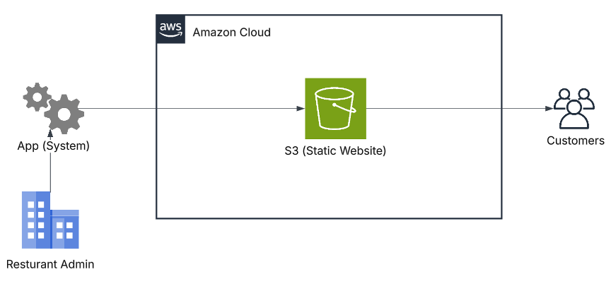
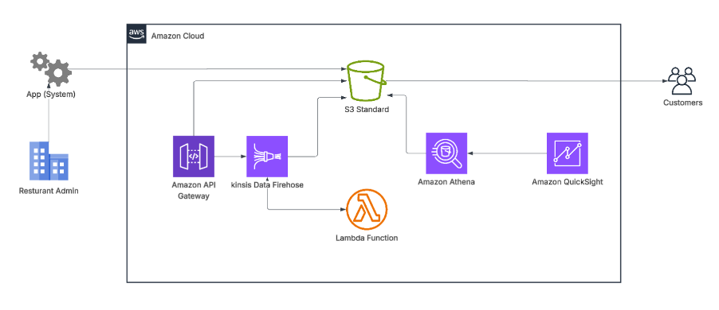

# Transforming a Restaurant Application with AWS Analytics: From Static Hosting to Data-Driven Insights
In today's digital landscape, simply hosting an application is no longer enough. Businesses need actionable insights from their data to improve customer experiences, optimise operations, and make informed decisions. Recently, I explored how a traditional restaurant application architecture can be enhanced with AWS analytics services to unlock greater business value.
 - 1")

## Client Business Overview:
The client owns a restaurant and has a dedicated development team responsible for maintaining its application. Rather than providing customers with traditional printed menus, QR codes have been placed on each table throughout the restaurant. When scanned, these QR codes direct customers to a static website where they can browse the menu and select the items they wish to order. Once customers have made their selections, a waiter attends the table to take note of the order, after which the food preparation and serving process begins.

## Issues Facing:
* Customers are required to wait for a waiter to attend to their table and record their order after they have selected their items from the digital menu.
* Due to limited staffing levels, the restaurant is experiencing operational challenges that are negatively impacting its reputation and overall customer experience.
* Delays in taking orders and serving food create frustration for both customers and staff, resulting in reduced efficiency and lower customer satisfaction

## Requirements:
### Functional requirements:
* The system must provide an HTTPS RESTful endpoint to ingest clickstream (analytics) data from the customers.
* The endpoint should be exposed via a managed AWS service (e.g., Amazon API Gateway) rather than a self‑managed server.
* The solution must focus on the data analytics pipeline only (ingestion, storage, processing, analysis, reporting).

### Non‑functional / technical requirements:
* Use AWS-managed, serverless services wherever possible.
* Use cost‑effective, usage‑based billing (pay per use), not time‑based (e.g., avoid always‑on servers).
* Ensure data durability, including backups to a different AWS Region.
* Ensure encryption in transit (HTTPS/TLS) and encryption at rest (e.g., KMS‑encrypted storage).
* The architecture should be scalable and reliable to handle varying traffic.

## Current Architecture:
The following is the existing architecture of the application. This architecture uses Amazon S3 Static Website Hosting inside an AWS Virtual Private Cloud (VPC) to deliver the restaurant application. The Restaurant Admin manages the application and uploads website content to the S3 bucket. Customers directly access the static website hosted on Amazon S3 through the internet.

## Proposed Solution:
The following is an improved and more scalable analytics architecture. The architecture introduces Amazon API Gateway to securely collect application or customer request data. Amazon Kinesis Data Firehose streams the incoming data in near real time to Amazon S3 for centralised storage. AWS Lambda transforms data before Amazon Kinesis Data Firehose ingests it into the object storage bucket. Amazon Athena allows SQL-based querying directly on the data stored in S3 without managing servers. Amazon QuickSight creates dashboards and visual reports for business insights and customer trends. Customers continue using the application normally while analytics run in the background. Restaurant Admins can monitor sales, customer activity, and system performance through dashboards. Overall, this architecture improves real-time analytics, scalability, automation, and business intelligence capabilities.

## AWS Services Used:
* **Amazon API Gateway:** Acts as the entry point for the application and securely receives API requests, user activity, and transaction data from the system.
* **Amazon Kinesis Data Firehose:** Collects and streams real-time data from the application to storage services for analytics processing.
* **AWS Lambda:** Transforms data before Amazon Kinesis Data Firehose ingests it into the object storage bucket
* **Amazon S3 (Simple Storage Service):** Stores application data, logs, analytics data, and processed files in a scalable and durable storage system.
* **Amazon Athena:** Allows SQL queries directly on data stored in S3 without needing a separate database server.
* **Amazon QuickSight:** Creates custom dashboards, charts, and visual analytics reports for monitoring business insights and customer trends.
* **Amazon Cloud / AWS Environment:** Provides a secure and scalable cloud infrastructure where all services are hosted and connected.

## Security Considerations:
* API Security (Amazon API Gateway)
* Data Validation and Sanitisation
* Network Protection
* Data Encryption
* Access Control and IAM Policies
* Secure S3 Buckets
* Lambda Function Security
* Network Protection
* Backup and Disaster Recovery
* Compliance and Privacy

## Cost Optimisation Strategies
One of the advantages of this design is its use of serverless and pay-as-you-go services. Cost optimisation can be achieved through:

* Athena query optimisation using Parquet and compressed formats
* S3 lifecycle policies and Intelligent-Tiering
* Lambda memory and execution tuning
* Firehose buffering and compression
* QuickSight SPICE optimization
* AWS Budgets and resource tagging for cost visibility

This approach minimises infrastructure overhead while maintaining performance and scalability.

## Measuring Business Outcomes
The success of an analytics platform should be measured through business outcomes, including:

* Improved customer satisfaction
* Faster reporting and decision-making
* Increased operational efficiency
* Revenue growth through customer insights
* Enhanced system scalability
* Reduced infrastructure costs
* Better visibility through business intelligence dashboards

## Final Thoughts:
The transition from a traditional cloud-hosted application to an analytics-enabled architecture demonstrates how organisations can move beyond simply running applications and begin leveraging data as a strategic asset.
By combining Amazon API Gateway, Kinesis Data Firehose, Lambda, S3, Athena, and QuickSight, organisations can create a scalable, secure, and cost-effective analytics ecosystem that transforms raw data into meaningful business intelligence.
As businesses continue their cloud transformation journeys, integrating analytics into application architectures is no longer optional. It's a key driver of innovation, operational excellence, and competitive advantage.

#AWS #CloudComputing #DataAnalytics #Serverless #AmazonWebServices #Architecture #BusinessIntelligence #QuickSight #Athena #Lambda #Kinesis #CloudArchitecture #DigitalTransformation #CloudEngineer #SolutionArchitect
